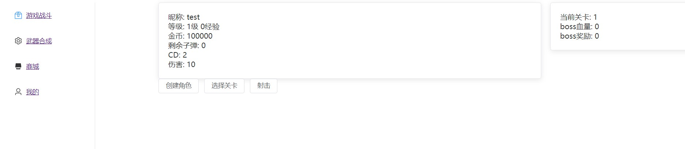
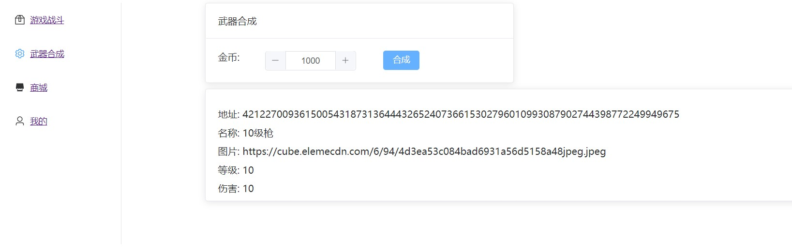
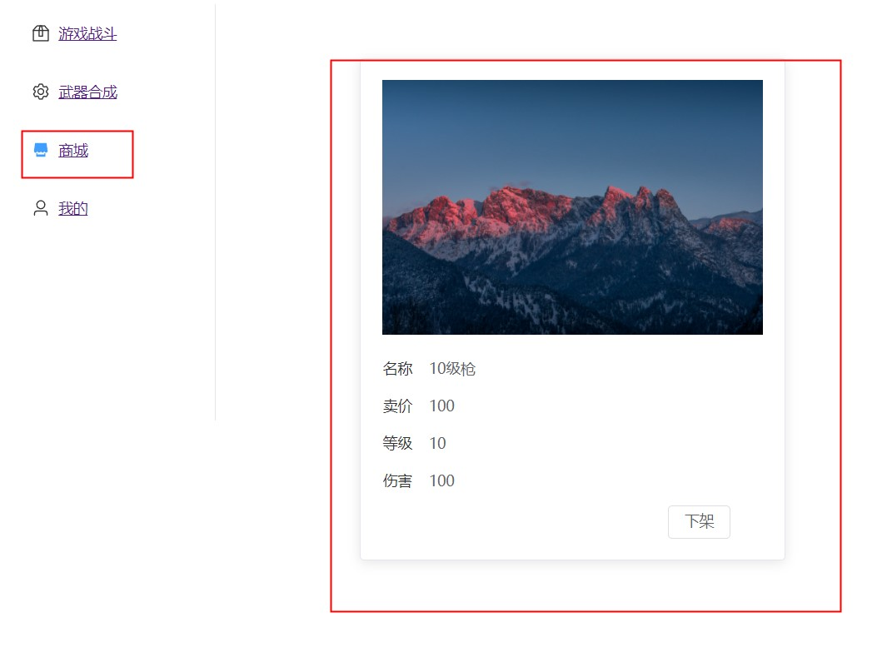
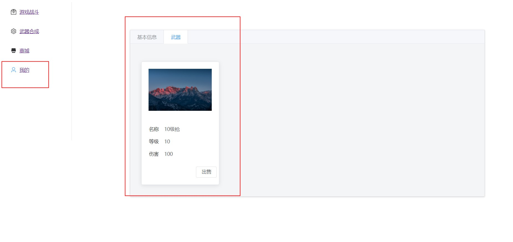

# Gamefi初次尝试[一]

区块链新手,主JAVA开发,本着边学边做的学习方法,利用被小厂压榨的空隙,构建的一个GameFi项目,较多问题,请多指教

## 1. 基本功能
> 主线内容: 选择相应的关卡进行打怪升级,获得金币(目前经验值没有啥用),合成武器(NFT),武器拥有不同的属性(伤害,外观等),可以在商城进行交易,交易获得更好的武器后,装载进行更快速的升级打怪

### 1.1 战斗模块
- 游戏战斗

- 武器合成

- 商城

- 我的

## 2.技术栈描述
前端: VUE3+ElementPlus+Web3
智能合约: Solidity,Truffle,Ganache

## 3.代码逻辑概述

### 3.1 代码参考项目:
- CryptoKitties
- Zeppelin

### 3.2 资产相关:
- 基础货币合约(FT): GameCoin
- 武器合约(NFT):  WeaponCore

- 武器合成合约: CompoundWeapon

### 3.3 战斗合约: 
- FightWar

### 3.4 商城合约
- TradeMarket

## 4.TODO
    1.非资产性的信息可以采用中心化的服务去做,减少gas费
    2.如何保证武器合成的tokenId能够存在相应的武器图片?
    3.增加单元测试
    4.代码安全性优化
    5.将游戏从Vue转向unity3D,unity3D基础教程已走马观花完,游戏1.0版本待开发

## 5.代码

[GitHub](https://github.com/xzyterry/fightwar)

PS: 1月才开始接触solidity,3月才接触unity3D,较多未完成,持续更新中
